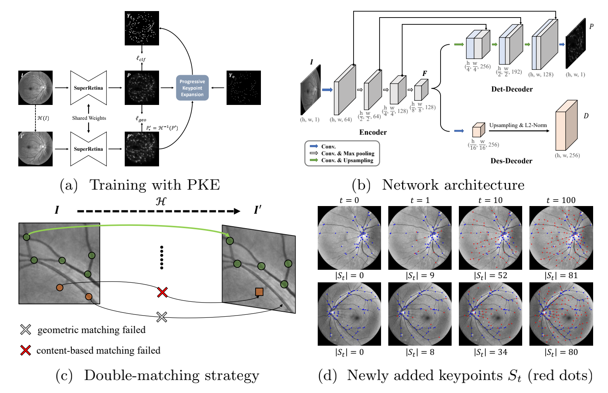

# SuperRetina for Retinal Image Matching

[](https://paperswithcode.com/sota/image-registration-on-fire?p=semi-supervised-keypoint-detector-and)

This is the official source code of our ECCV2022 paper: [Semi-Supervised Keypoint Detector and Descriptor for Retinal Image Matching](https://arxiv.org/abs/2207.07932).



## Environment
We used Anaconda to setup a deep learning workspace that supports PyTorch. Run the following script to install all the required packages.

``` conda
conda create -n SuperRetina python==3.8 -y
conda activate SuperRetina
git clone https://github.com/ruc-aimc-lab/SuperRetina.git
cd SuperRetina
pip install -r requirements.txt
```

## Downloads

### Data
See the [data](data) pape. SuperRetina is trained on a small amount of keypoint annotations, which can be either manually labeled or auto-labeled by a specific keypoint detection algorithm. Check [notebooks/read_keypoint_labels.ipynb](notebooks/read_keypoint_labels.ipynb) to see our data format of keypoint annotations.

### Models

You may skip the training stage and use our provided models for keypoint detection and description on retinal images.
+ [Google drive](https://drive.google.com/drive/folders/1h-MH3wEiN7BoLyMRjF1OAwABKqq6gVFL?usp=sharing)

Put the trained model into `save/` folder.


## Code

### Training 

Write the [config/train.yaml](config/train.yaml) file before training SuperRetina. Here we provide a demo training config file. Then you can train SuperRetina on your own data by using the following command.

```
python train.py
```

### Inference

#### Registration Performance
The [test_on_FIRE.py](test_on_FIRE.py) code shows how image registration is performed on the FIRE dataset.
```
python test_on_FIRE.py
```
If everything goes well, you shall see the following message on your screen:
```
----------------------------------------
Failed:0.00%, Inaccurate:1.50%, Acceptable:98.50%
----------------------------------------
S: 0.950, P: 0.554, A: 0.783, mAUC: 0.762
```

#### Identity Verification Performance

The [test_on_VARIA.py](./test_on_VARIA.py) code shows how identity verification is performed on the VARIA dataset.
```
python test_on_VARIA.py
```
If everything goes well, you shall see the following message on your screen:
```
VARIA DATASET
EER: 0.00%, threshold: 40
```

---

We have also provided some tutorial codes showing step-by-step usage of SuperRetina:
+ [notebooks/tutorial-inference.ipynb](notebooks/tutorial-inference.ipynb): Perform registration for a given pair of images.
+ [notebooks/eval-registration-on-FIRE.ipynb](notebooks/eval-registration-on-FIRE.ipynb): Evaluation on the [FIRE](https://projects.ics.forth.gr/cvrl/fire/) dataset.

## Citations
If you find this repository useful, please consider citing:
```
@inproceedings{liu2022SuperRetina,
  title={Semi-Supervised Keypoint Detector and Descriptor for Retinal Image Matching},
  author={Jiazhen Liu and Xirong Li and Qijie Wei and Jie Xu and Dayong Ding},
  booktitle={Proceedings of the 17th European Conference on Computer Vision (ECCV)},
  year={2022}
}
```

## Contact
If you encounter any issue when running the code, please feel free to reach us either by creating a new issue in the GitHub or by emailing

+ Jiazhen Liu (liujiazhen@ruc.edu.cn)

